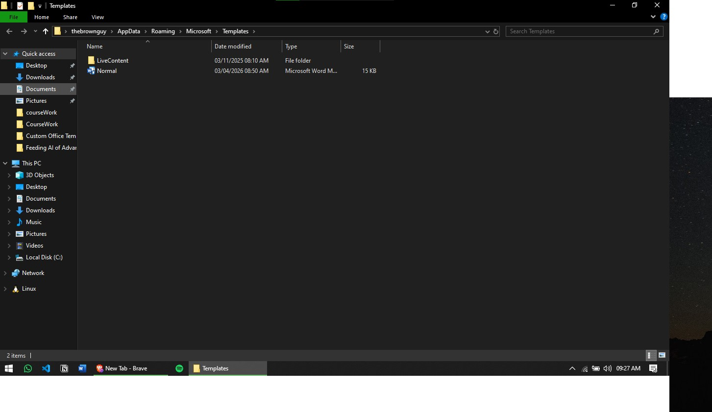

# University Word Template

This project contains a preformatted Microsoft Word template designed for university documents. It already includes the layout and styling you want for consistent academic work, such as:

- Proper heading styles
- Clean spacing and margins
- A professional document structure
- Default formatting that helps keep documents consistent

## How to use it

1. Close Microsoft Word before installing the template.
2. Open File Explorer and go to this folder:
   `%appdata%\Microsoft\Templates`
3. Back up your current template file if needed.
4. Replace the existing template in that folder with the template from this project.
5. Reopen Microsoft Word.
6. Create a new document using the template, or let Word use it as the default if it is saved as the normal template.

## Important note

If you are replacing Word's default template, the file is usually named `Normal.dotm`. Make sure you keep a backup copy before overwriting it.

## Where to place the file

For most Windows installations, the template location is:

`%appdata%\Microsoft\Templates`

If you want this template to become Word's main default template, place it in that folder with the expected name, such as `Normal.dotm`.

## Best results

- Use the template in Microsoft Word on Windows
- Restart Word after copying the file
- Keep a backup of the original template in case you want to restore it later

## File in this project

- `Normal.dotm`

## Preview

